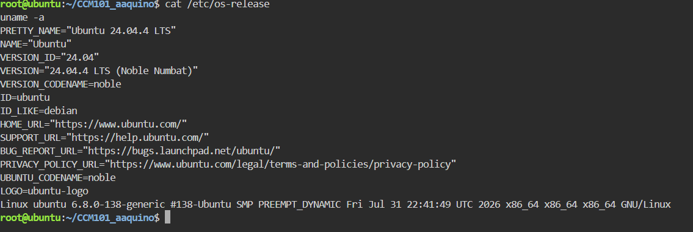
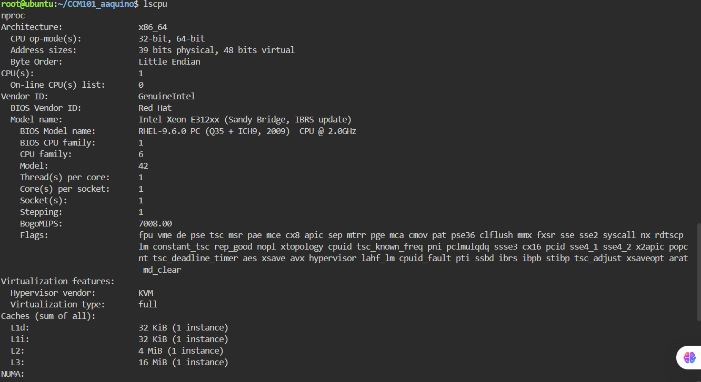
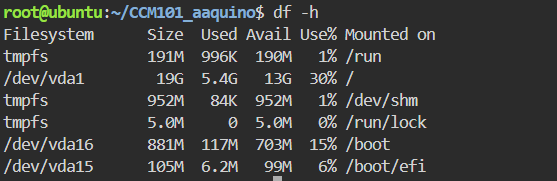

# Linux Server Investigation — KillerCoda

## Operating System

- OS: Ubuntu 24.04.4 LTS (Noble Numbat)
- Kernel version: 6.8.0-138-generic
- Architecture: x86_64

## CPU Information

- Vendor: Intel (Xeon E312xx, Sandy Bridge)
- CPU(s): 1
- Core(s) per socket: 1
- Thread(s) per core: 1
- Clock speed: ~2.0 GHz
- Virtualization: KVM (full virtualization)

## Memory

- Total RAM: 1.9 GiB
- Used: 422 MiB
- Free: 851 MiB
- Available: 1.4 GiB
- Swap: 1.0 GiB (unused)

## Disk Space

- Root filesystem (/dev/vda1): 19G total, 5.4G used, 13G available (30% used)
- Boot partition (/dev/vda16): 881M
- EFI partition (/dev/vda15): 105M

## Cloud Migration Analysis

**If this Linux server were migrated to the cloud, which AWS, Azure, and GCP services could host it?**

This server is a single-core, ~2GB RAM, ~19GB disk Ubuntu machine — a small, lightweight workload with no heavy compute or storage demand. That profile fits entry-level or burstable virtual machine tiers rather than high-performance compute.

- **AWS:** EC2 t3.small — provides 2 vCPUs and 2 GiB RAM and is designed for general-purpose workloads with burstable CPU performance. It is a good fit for this small Ubuntu server running on an x86_64 architecture.
- **Azure:** Standard_B2s — provides 2 vCPUs and 4 GiB RAM and uses burstable CPU performance, making it appropriate for small, intermittent workloads like this server.
- **GCP:** Compute Engine e2-small — provides 2 vCPUs and 2 GiB RAM, closely matching the server's current memory requirements and providing sufficient capacity for a lightweight Ubuntu workload.

Overall, AWS EC2 t3.small, Azure Standard_B2s, and GCP Compute Engine e2-small are suitable cloud options because this server has modest CPU, memory, and storage requirements.
