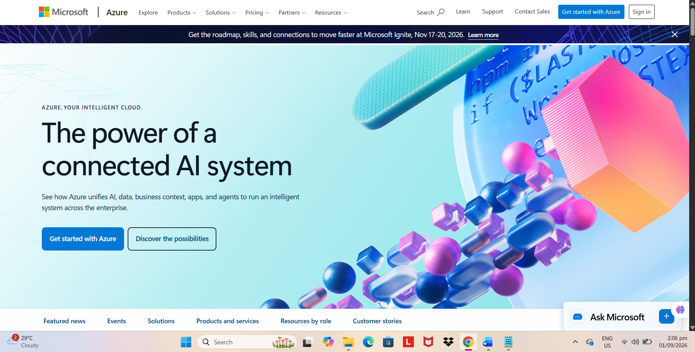

# Microsoft Azure Research

## Brief Overview

Microsoft Azure is Microsoft's cloud computing platform. Azure provides cloud services for computing, storage, databases, networking, security, identity, analytics, artificial intelligence, machine learning, containers, and application development.

Azure allows organizations to run applications and store data in Microsoft's global cloud infrastructure without having to maintain all of the physical hardware themselves.

## Global Infrastructure

Azure has a global infrastructure consisting of geographic regions and datacenters. Microsoft currently describes Azure as having more than 80 regions and more than 500 datacenters worldwide.

Azure's global infrastructure allows organizations to select locations based on requirements such as latency, data residency, availability, compliance, and disaster recovery.

Azure also provides networking and infrastructure capabilities that allow organizations to connect cloud workloads with other Azure regions and on-premises environments.

## Cloud Management Console

The Azure Portal is a web-based management interface for creating, configuring, monitoring, and managing Azure resources. Users can manage virtual machines, databases, networks, storage, applications, and other Azure services through the portal.

## Four (4) Core Services

1. **Azure Virtual Machines** – Provides Windows and Linux virtual machines for running applications and workloads.
2. **Azure Blob Storage** – Provides massively scalable object storage for files and unstructured data.
3. **Azure SQL Database** – Provides a managed SQL database service for cloud applications.
4. **Azure Virtual Network (VNet)** – Provides private networking and network segmentation for Azure resources.

## Three (3) Advantages

1. **Microsoft Integration** – Azure integrates strongly with Microsoft technologies such as Windows Server, Microsoft Entra ID, Microsoft 365, and other enterprise products.
2. **Global Infrastructure** – Azure provides a large worldwide infrastructure that supports applications requiring global deployment, low latency, and data residency.
3. **Hybrid Cloud Support** – Azure provides technologies such as Azure Arc that help organizations manage resources across Azure, other clouds, and on-premises environments.

## Typical Enterprise Use Cases

- Enterprise application hosting
- Windows Server workloads
- Microsoft SQL database workloads
- Web application hosting
- Virtual desktop infrastructure
- Backup and disaster recovery
- Artificial intelligence and machine learning
- Data analytics
- Hybrid cloud environments
- Application modernization
- Enterprise identity management
- Software development and testing
