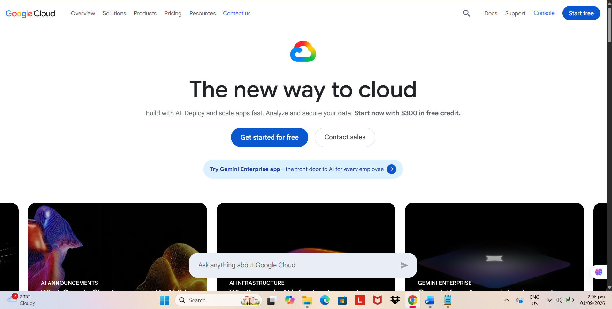

# Google Cloud Platform Research

## Brief Overview

Google Cloud Platform (GCP), commonly called Google Cloud, is Google's cloud computing platform. It provides cloud services for computing, storage, databases, networking, analytics, artificial intelligence, machine learning, Kubernetes, and application development.

Google Cloud allows organizations to build, deploy, and manage applications using Google's global cloud infrastructure.

## Global Infrastructure

Google Cloud organizes its infrastructure into regions and zones. Google Cloud currently lists 43 global regions and 130 zones.

A region is an independent geographic area containing zones. A zone is a deployment area within a region and can be considered a failure domain. Organizations can deploy workloads across multiple zones and regions to improve availability, reliability, and disaster recovery.

Google also operates a global network connecting its cloud infrastructure around the world.

## Cloud Management Console

The Google Cloud Console is a web-based management interface used to create, configure, monitor, and manage Google Cloud resources. It can be used to manage virtual machines, storage, databases, networks, Kubernetes clusters, and other Google Cloud services.

## Four (4) Core Services

1. **Compute Engine** – Provides virtual machines for running applications and workloads.
2. **Cloud Storage** – Provides scalable object storage for data and files.
3. **Cloud SQL** – Provides a fully managed relational database service for MySQL, PostgreSQL, and SQL Server.
4. **Google Cloud VPC** – Provides global virtual networking for Google Cloud resources.

## Three (3) Advantages

1. **Data Analytics** – Google Cloud provides powerful services for large-scale data processing and analytics.
2. **Artificial Intelligence and Machine Learning** – Google Cloud provides extensive AI and machine-learning technologies and infrastructure.
3. **Kubernetes and Cloud-Native Technology** – Google developed Kubernetes and provides Google Kubernetes Engine (GKE) for managed Kubernetes workloads.

## Typical Enterprise Use Cases

- Big-data processing
- Data analytics
- Artificial intelligence
- Machine learning
- Website hosting
- Cloud-native applications
- Kubernetes applications
- Database hosting
- Application development
- Enterprise data warehouses
- Disaster recovery
- Global application deployment
